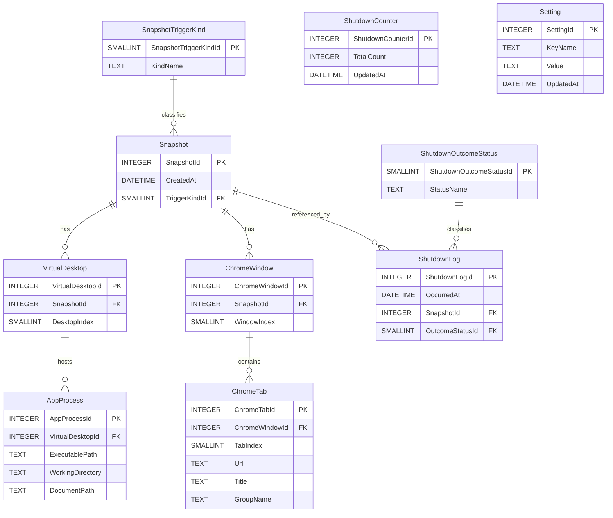

# ERD

```mermaid
erDiagram
    Snapshot ||--o{ VirtualDesktop : has
    Snapshot ||--o{ ChromeWindow : has
    Snapshot ||--o{ ShutdownLog : referenced_by
    VirtualDesktop ||--o{ AppProcess : hosts
    ChromeWindow ||--o{ ChromeTab : contains
    SnapshotTriggerKind ||--o{ Snapshot : classifies
    ShutdownOutcomeStatus ||--o{ ShutdownLog : classifies

    Snapshot {
        INTEGER SnapshotId PK
        DATETIME CreatedAt
        SMALLINT TriggerKindId FK
    }
    VirtualDesktop {
        INTEGER VirtualDesktopId PK
        INTEGER SnapshotId FK
        SMALLINT DesktopIndex
    }
    AppProcess {
        INTEGER AppProcessId PK
        INTEGER VirtualDesktopId FK
        TEXT ExecutablePath
        TEXT WorkingDirectory
        TEXT DocumentPath
    }
    ChromeWindow {
        INTEGER ChromeWindowId PK
        INTEGER SnapshotId FK
        SMALLINT WindowIndex
    }
    ChromeTab {
        INTEGER ChromeTabId PK
        INTEGER ChromeWindowId FK
        SMALLINT TabIndex
        TEXT Url
        TEXT Title
        TEXT GroupName
    }
    ShutdownLog {
        INTEGER ShutdownLogId PK
        DATETIME OccurredAt
        INTEGER SnapshotId FK
        SMALLINT OutcomeStatusId FK
    }
    ShutdownCounter {
        INTEGER ShutdownCounterId PK
        INTEGER TotalCount
        DATETIME UpdatedAt
    }
    Setting {
        INTEGER SettingId PK
        TEXT KeyName
        TEXT Value
        DATETIME UpdatedAt
    }
    SnapshotTriggerKind {
        SMALLINT SnapshotTriggerKindId PK
        TEXT KindName
    }
    ShutdownOutcomeStatus {
        SMALLINT ShutdownOutcomeStatusId PK
        TEXT StatusName
    }
```
